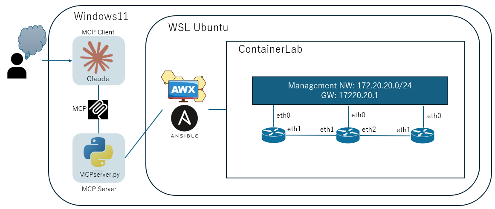

# MCPServer_NWTroubleShoot

MCP Server that troubleshooting target network

---

## 📘 概要 (Overview)

このリポジトリは、**Claude による MCP（Model Context Protocol）** を用いて  
ネットワークトラブルシュートを自動化する PoC 環境です。

AWX（Ansible Tower）、ContainerLab、VyOS を組み合わせ、  
`show` コマンドの安全な実行と MCP 経由での解析を検証します。

| 項目          | 内容                      |
| ------------- | ------------------------- |
| **ホスト OS** | Windows 11                |
| **仮想環境**  | WSL2 (Ubuntu 22.04.5 LTS) |



---

## 📁 ディレクトリ構成 (Directory Structure)

```
MCPServer_NWTroubleShoot/
├─ mcp-awx/ # MCP サーバ本体 (Claude MCP 連携エントリポイント)
│ ├─ server.py # MCP⇔AWX 連携サーバ
│ ├─ .env # AWX 接続情報 (URL / Token / JobTemplate ID)
│ └─ pycache/
│
├─ awx/ # AWX 実行環境 (Ansible Execution Environment)
│ ├─ Dockerfile.awx-ee-vyos
│ ├─ execution-environment.yml
│ ├─ requirements.txt / requirements.yml
│ └─ context/
│
├─ container-lab/ # ContainerLab 構成と検証用 Playbook 群
│ └─ lab1/
│ ├─ lab1.yml
│ ├─ show.yml / show_pretty.yml
│ ├─ inventory.yml / vault.yml
│ └─ configs/, results/, ansible.cfg
│
├─ vyos/ # VyOS ISO → Docker イメージ化スクリプト
│ ├─ vyos_build.sh
│ ├─ Dockerfile
│ ├─ rootfs.tar
│ ├─ vyos-*.iso
│ └─ live/
│
└─ README.md
```

---

## ⚙️ 環境構築と実行 (Setup & Execution)

### 🧩 1. VyOS イメージビルド

```bash
cd vyos
./vyos_build.sh --iso ./vyos-2025.10.01-0021-rolling-generic-amd64.iso \
                --tag vyos:rolling-2025.10.01
```

VyOS ISO から rootfs を抽出し、
`FROM scratch` ベースで Docker イメージを生成します。
ContainerLab で利用可能な軽量 VyOS コンテナを作成します。

🧱 2. ContainerLab トポロジ起動

```bash
cd container-lab/lab1
sudo containerlab deploy -t lab1.yml
```

複数の VyOS ノードを構築し、
AWX 経由で `show` コマンドを実行・収集する環境を起動します。

🧰 3. AWX 実行環境 (Execution Environment) のビルド

```bash
cd awx
docker build -t awx-ee-vyos -f Dockerfile.awx-ee-vyos .
```

含まれる主な要素:

`vyos.vyos` コレクション

`paramiko` などの Python 依存モジュール

🧠 4. MCP サーバ起動

```bash
cd mcp-awx
pip install -r requirements.txt
python server.py
```

`.env` 設定例:

```
AWX_URL=https://awx.local
AWX_TOKEN=<your-awx-api-token>
AWX_TEMPLATE_ID=9
```

`Claude` や他の MCP クライアントからこのサーバを叩くことで、
AWX のジョブテンプレートを経由して安全に `show` コマンドを実行できます。

---

## 再起動時のメモ

```
# 1. WSL起動
wsl

# 2. Docker起動（自動起動してない場合）
sudo service docker start

# 3. AWXを再開
cd ~/awx
docker compose up -d

# 4. ContainerLabを再構築
cd ~/container-lab/lab1
sudo containerlab deploy -t lab1.yml

# 5. MCPサーバ再起動
cd ~/MCPServer_NWTroubleShoot/mcp-awx
python3 -m venv .venv
source .venv/bin/activate
pip install -r requirements.txt
python server.py
```
